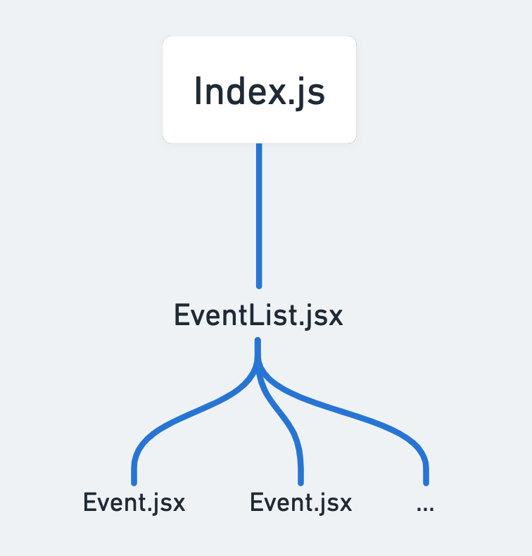

# NIC and Motorpoint Arena Tech Task
A single page application which shows the next events on at the Motorpoint Arena Nottingham. Created as part of the application process for a Junior Developer role.
## Getting Started

* Install all dependencies with `npm install`
* Run the development server with `npm run dev`. Open [http://localhost:3000](http://localhost:3000) with your browser to see the result.
* Run jest unit tests with `npm run test`

### React Component Tree

## Potential developments
* Add a search bar that filters the events
* Add sort by options to change the order events are displayed in
* Add a customised 404 page
